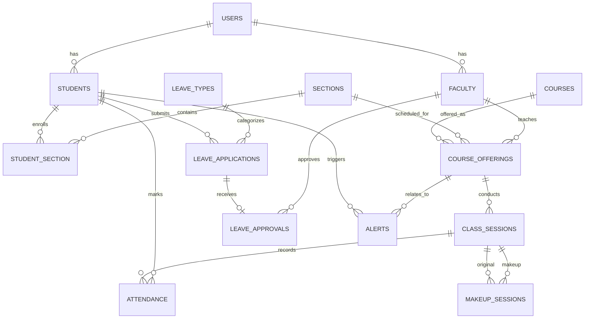

# Entity Relationship Diagram (ERD)

```mermaid
erDiagram
    USERS ||--o{ STUDENTS : has
    USERS ||--o{ FACULTY : has
    
    STUDENTS ||--o{ STUDENT_SECTION : enrolls
    SECTIONS ||--o{ STUDENT_SECTION : contains
    
    COURSES ||--o{ COURSE_OFFERINGS : offered_as
    SECTIONS ||--o{ COURSE_OFFERINGS : scheduled_for
    FACULTY ||--o{ COURSE_OFFERINGS : teaches
    
    COURSE_OFFERINGS ||--o{ CLASS_SESSIONS : conducts
    
    CLASS_SESSIONS ||--o{ ATTENDANCE : records
    STUDENTS ||--o{ ATTENDANCE : marks
    
    STUDENTS ||--o{ LEAVE_APPLICATIONS : submits
    LEAVE_TYPES ||--o{ LEAVE_APPLICATIONS : categorizes
    
    LEAVE_APPLICATIONS ||--o| LEAVE_APPROVALS : receives
    FACULTY ||--o{ LEAVE_APPROVALS : approves
    
    CLASS_SESSIONS ||--o{ MAKEUP_SESSIONS : original
    CLASS_SESSIONS ||--o{ MAKEUP_SESSIONS : makeup
    
    STUDENTS ||--o{ ALERTS : triggers
    COURSE_OFFERINGS ||--o{ ALERTS : relates_to
```
